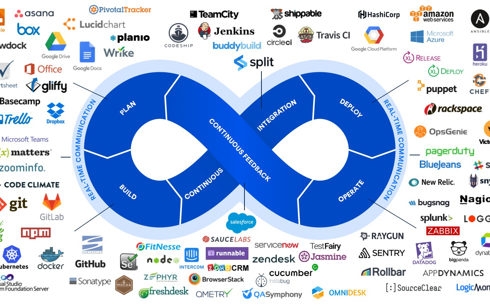
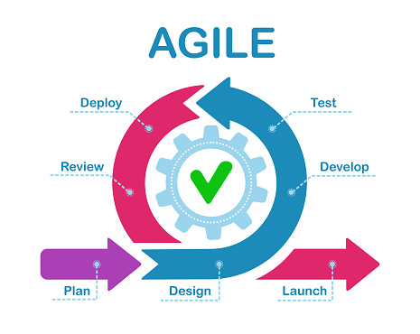
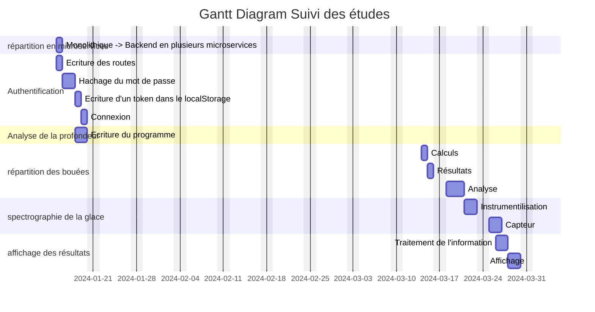
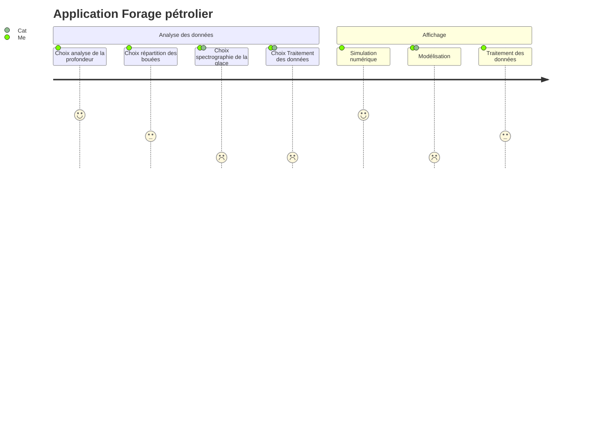

# Analyse sujet Anthony

## 1. back et front : microservices ?
explosé notre api
back
authentification
ajout des pilotes
ajout des courses

authentification
analyse de la profondeur
répartition des bouées
spectrographie de la glace
affichage des données

front
dockerisation

améliorer le travail d'équipes comptabilité, RH
ceux qui recuperent le besoin client PO
communication devOPs
chefs de projets, scrum master.

## 2. Dockerfile, run build, dockercompose

```bash
docker run -dp 80:80 docker/getting-started
```
Pour les images docker et les containers

```ts
FROM node:19

# Define the working directory, where the application will reside inside the Docker
WORKDIR /usr/src/app

# Copy package.json to the working directory
COPY package*.json .

#Run the npm install command to install the application dependencies on Docker

RUN npm install

# Copy the rest of the application files to Docker, i.e., app.js
COPY . .

EXPOSE 4000

CMD ["npm","run", "start"]
```

## 3. Qu'est-ce que Kubernetes ? k8s + orchestrateur : performance minimale sur l'utilisation des conteneurs docker si un ne suffie pas on peut en lancer 1,2,3,4. J'ai une image docker et on peut lancer jusqu'à 4 conteneurs. L'orchestrateur définit qui doit lancer le conteneur et sur quelle machine lancer.

## 4. Agilité schéma, Méthode Scrum, Sprint, Sprint Review, PO, Backlog, dockerisation, vercel







## 5. Screenshots tests, tests unitaires, tests e2e les tests unitaires se font avant l'écriture du code mais peuvent se faire aussi après avoir dockerisé l'application, les tests e2e se font après la release.

### tests unitaires

avec vitest.
```ts
test('adds 1 + 2 to equal 3', () => {
    expect(sum(1,2)).toBe(3)
})
```

### tests e2e

exemple de code
avec l'utilisation de playwright
```ts
import { test, expect } from '@playwright/test';

test('has title', async ({ page }) => {
  await page.goto('https://playwright.dev/');

  // Expect a title "to contain" a substring.
  await expect(page).toHaveTitle(/Playwright/);
});

test('get started link', async ({ page }) => {
  await page.goto('https://playwright.dev/');

  // Click the get started link.
  await page.getByRole('link', { name: 'Get started' }).click();

  // Expects page to have a heading with the name of Installation.
  await expect(page.getByRole('heading', { name: 'Installation' })).toBeVisible();
});cd


```
## 6. 