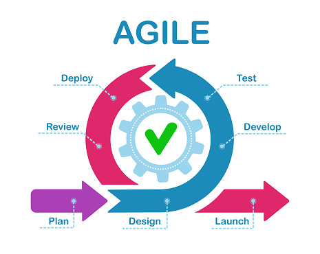
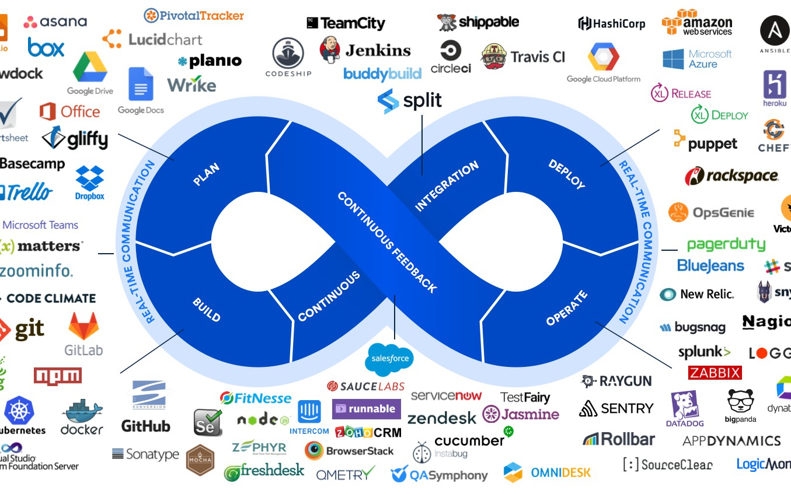

# Calculateur simulateur monolithique

## 1. Décomposition en Microservices

A. Seul le backend peut être décomposé en microservices. Les fonctionnalités spécifiques de l'application peuvent être décomposées en microservices. Ainsi, les fonctionnalités transformées en microservices indépendants sont :
1. Authentification
2. Analyse de la profondeur
3. Répartition des bouées
4. Spectrographie de la glace
5. Affichage des données

B. Pour assurer la cohérence et la communication entre les équipes travaillant sur différents microservices, il faut :
1. Améliorer le travail d'équipe
2. Communiquer avec la comptabilité et les ressources humaines
3. Définir le besoin client. Cette tâche est réalisée par le Product Owner. Il doit produire un Product Backlog.
4. Assurer la communication avec les acteurs de la méthodologie devOps. Il s'agit de réaliser l'intégration continue et le déploiement continu de l'application.
5. Organiser des réunions avec les chefs de projets et le scrum master.

## 2. Containerisation avec Docker

A. Docker peut containeriser chaque microservice. Plus exactement, pour chaque microservice on produit une image docker qui doit ensuite être containerisée. Les containers s'exécutent une fois composés avec dockercompose ou orchestrés avec le framework Kubernetes.
Ils peuvent ainsi être déployés vers plusieurs types de supports.
1. La méthodologie pour produire des images et les containerisées est décrite dans le tutoriel :
```bash
docker run -dp 80:80 docker/getting-started
```
2. Un fichier Dockerfile doit être présent à la racine du projet, ainsi que le .dockerignore. Un exemple de Dockerfile est le suivant :
```ts
FROM node:19

# Define the working directory, where the application will reside inside the Docker
WORKDIR /usr/src/app

# Copy package.json to the working directory
COPY package*.json .

#Run the npm install command to install the application dependencies on Docker

RUN npm install

# Copy the rest of the application files to Docker, i.e., app.js
COPY . .

EXPOSE 4000

CMD ["npm","run", "start"]
```
B. Pour gérer les dépendances entre microservices dans un environnement Dockersisé, il faut utiliser dockercompose ou un framework comme Kubernetes qui permet l'orchestration des containers.

## 3. Orchestration avec Kubernetes

A. Kubernetes est essentiel pour orchestrer le déploiement des microservices. Il se définit par k8s + orchestrateur. On peut ainsi lancer (run) plusieurs containers au lieu d'un.

B. Pour garantir la flexibilité et l'évolutivité des microservices grâce à Kubernetes, l'orchestrateur dispose d'une performance minimale sur l'utilisation des containers docker. L'orchestrateur définit qui doit lancer le container et sur quelle machine le lancer.

## Méthodologie CI/CD Automatisée

A. Pour mettre en place une méthodologie CI/CD tenant compte de la séparation entre les équipes scientifiques et de production, il faut maîtriser les méthodologies Agile et DevOps.
1. Méthodologie Agile


La méthodologie Agile fait appel au besoin définit par le Product Owner, dans le backlog. Pour la réalisation, le travail utilise la méthode scrum (qui signifie mélée en anglais). Des sprints d'une durée de une à trois semaines sont réalisés. Le chef des programmeurs est le scrum master qui définit au mieux les besoins lors des daylies scrums. Ce sont des réunions de moins d'une demi-heure où les participants décrivent ce qu'ils ont fait, quels sont les points bloquants et ce qu'ils ont à faire. L'avant dernière étape d'un sprint est la Review avant l'éxécution du programme

2. Méthodologie DevOps


La méthodologie DevOps assure la communication entre les équipes de développeurs et les opérationnels. Elle se caractérise par un cycle infini entre l'intégration continue et le déploiement continu. La containerisation par Docker de l'application participe au déploiement, ainsi qu'une mise en production sur Versel à titre d'exemple.

B. Les étapes spécifiques qui doivent être automatisées pour garantir un processus CI/CD fiable
