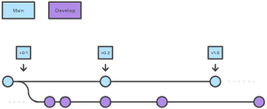
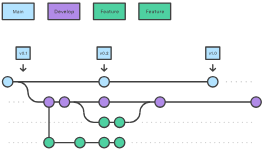
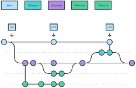
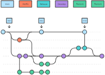
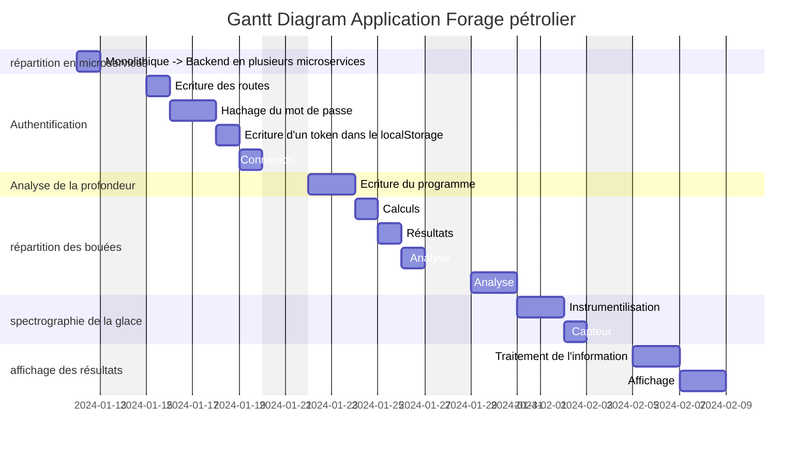
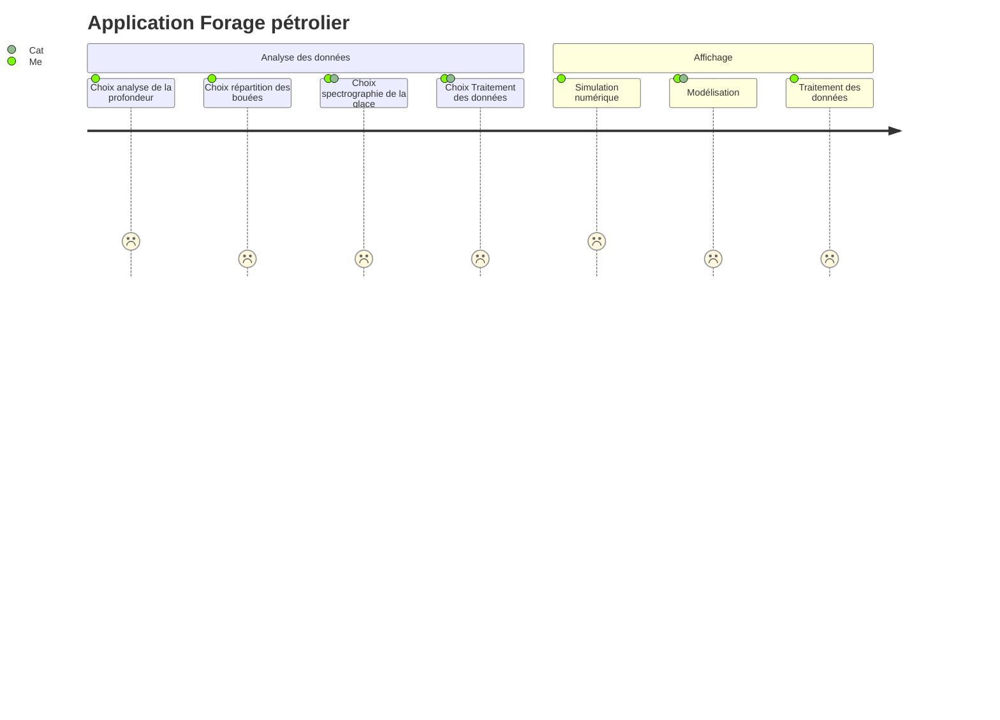
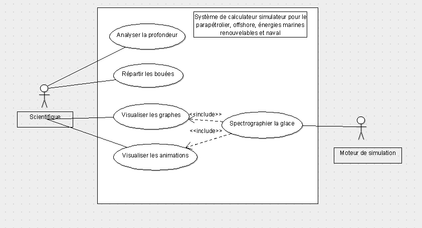

# Calculateur simulateur monolithique

## 1. Décomposition en Microservices

### A. Seul le backend peut être décomposé en microservices. Les fonctionnalités spécifiques de l'application peuvent être décomposées en microservices. Ainsi, les fonctionnalités transformées en microservices indépendants sont :

1. Authentification
2. Analyse de la profondeur
3. Répartition des bouées
4. Spectrographie de la glace
5. Affichage des données

### B. Pour assurer la cohérence et la communication entre les équipes travaillant sur différents microservices, il faut :

1. Améliorer le travail d'équipe
2. Communiquer avec la comptabilité et les ressources humaines
3. Définir le besoin client. Cette tâche est réalisée par le Product Owner. Il doit produire un Product Backlog.
4. Assurer la communication avec les acteurs de la méthodologie devOps. Il s'agit de réaliser l'intégration continue et le déploiement continu de l'application.
5. Organiser des réunions avec les chefs de projets et le scrum master.

## 2. Containerisation avec Docker

### A. Docker peut containeriser chaque microservice. Plus exactement, pour chaque microservice on produit une image docker qui doit ensuite être containerisée. Les containers s'exécutent une fois composés avec dockercompose ou orchestrés avec le framework Kubernetes.
Ils peuvent ainsi être déployés vers plusieurs types de supports.
1. La méthodologie pour produire des images et les containerisées est décrite dans le tutoriel :
```bash
docker run -dp 80:80 docker/getting-started
```
2. Un fichier Dockerfile doit être présent à la racine du projet, ainsi que le .dockerignore. Un exemple de Dockerfile est le suivant :
```ts
FROM node:19

# Define the working directory, where the application will reside inside the Docker
WORKDIR /usr/src/app

# Copy package.json to the working directory
COPY package*.json .

#Run the npm install command to install the application dependencies on Docker

RUN npm install

# Copy the rest of the application files to Docker, i.e., app.js
COPY . .

EXPOSE 4000

CMD ["npm","run", "start"]
```
### B. Pour gérer les dépendances entre microservices dans un environnement Dockersisé, il faut utiliser dockercompose ou un framework comme Kubernetes qui permet l'orchestration des containers.

## 3. Orchestration avec Kubernetes

### A. Kubernetes est essentiel pour orchestrer le déploiement des microservices. Il se définit par k8s + orchestrateur. On peut ainsi lancer (run) plusieurs containers au lieu d'un.

### B. Pour garantir la flexibilité et l'évolutivité des microservices grâce à Kubernetes, l'orchestrateur dispose d'une performance minimale sur l'utilisation des containers docker. L'orchestrateur définit qui doit lancer le container et sur quelle machine le lancer.

## 4. Méthodologie CI/CD Automatisée

### A. Pour mettre en place une méthodologie CI/CD tenant compte de la séparation entre les équipes scientifiques et de production, il faut maîtriser les méthodologies Agile et DevOps.

1. Méthodologie Agile


La méthodologie Agile fait appel au besoin définit par le Product Owner, dans le backlog. Pour la réalisation, le travail utilise la méthode scrum (qui signifie mélée en anglais). Des sprints d'une durée de une à trois semaines sont réalisés. Le chef des programmeurs est le scrum master qui définit au mieux les besoins lors des daylies scrums. Ce sont des réunions de moins d'une demi-heure où les participants décrivent ce qu'ils ont fait, quels sont les points bloquants et ce qu'ils ont à faire. L'avant dernière étape d'un sprint est la Review avant l'éxécution du programme

2. Méthodologie DevOps


La méthodologie DevOps assure la communication entre les équipes de développeurs et les opérationnels. Elle se caractérise par un cycle infini entre l'intégration continue et le déploiement continu. La containerisation par Docker de l'application participe au déploiement, ainsi qu'une mise en production sur Versel.

3. Séparation entre les équipes scientifiques et de production

Les deux méthodologies sont utilisées par les développeurs. Ils peuvent communiquer avec les scientifiques via zoom, discord ou teams.

### B. Les étapes spécifiques qui doivent être automatisées pour garantir un processus CI/CD fiable sont l'utilisation d'un gitflow, l'utilisation des tests, la dockerisation des images.

4.1 Gitflow

    4.1.1 Branches

On propose deux branches principales :
_ la branche develop
_ la branche prod
La branche develop dispose d'autres branches qui participent à la mise en place de fonctionnalitées.
Les commits sont fréquents
Pour créer une branche : git branch <nom de la branche>
Pour se positionner sur une branche : git checkout <nom de la branche>
Pour créer une branche et se positionner dessus : git checkout -b <nom de la branche>
Pour fusionner la branche develop avec la branche prod en étant positionné sur la branche prod : git merge develop

    4.1.2 Pour réaliser un push

git init : pour créer un dépôt git
git status : pour voir l'état du répertoire
git add . : pour ajouter les modifications
git push : pour pousser les modifications vers github
d'autres méthodes comme git push --set-upstream permet de spécifier l'origine

    4.1.3 Pull Request (PR) :

Lors du travail de groupe github permet de notifier des pull request.
Une fois les modifications validées par les associés du projet, les méthodes git sont :
git checkout time-accueil
git add .
git commit -m "nom_du_commit"
git checkout main
git pull
git checkout time-accueil
git rebase main
git push origin time-accueil
(force with lease)

    4.1.4 Récupérer un dépôt distant

git clone <url du depot>
Sur github, il est aussi possible de forker un projet

4.2 Gitflow vs développement basé sur le tronc

4.2.1 Qu'est-ce que Gitflow ?

Gitflow est un modèle de branching Git alternatif qui utilise des branches de fonctionnalité et plusieurs branches primaires.
Comparé au développement basé sur le tronc, Gitflow dispose de davantage de branches plus longues et de commits plus importants. Dans ce modèle, les développeurs créent une branche de fonctionnalité et attendent que la fonctionnalité soit terminée pour la merger à la branche « trunk » principale. Ces branches de fonctionnalités au long cours nécessitent une plus grande collaboration lors du merge, car elles risquent davantage de dévier de la branche « trunk ». Elles peuvent également introduire des mises à jour conflictuelles.
Gitflow est parfaitement adapté aux projets avec un cycle de livraison planifié et pour les bonnes pratiques DevOps de livraison continue.

### A Fonctionnement



Deux branches sont utilisées :
_ la branche main stocke l'historique officiel des versions
_ la branche develop sert de branche d'intégration pour les fonctionnalités.
Pour créer une branche develop vide en local et la pusher vers le serveur
```bash
git branch develop
git push -u origin develop
```

### B Branches de fonctionnalité

Étape 1. Créez le dépôt
Il convient de créer une branche pour chaque fonctionnalité. Ces branches seront ensuite pushées vers le dépôt centralisé en vue d'une sauvegarde/collaboration. Cependant, au lieu de créer une branche à partir de main, les branches de fonctionnalité (feature) utilisent develop comme une branche parente. Lorsqu'une fonctionnalité est terminée, elle est à nouveau mergée dans la branche de développement. Les fonctionnalités ne communiquent jamais directement avec la branche principale (main).



Création d'une branche de fonctionnalité

```bash
git checkout develop
git checkout -b feature_branch
```

Terminer une branche de fonctionnalité
Lorsque vous avez terminé le travail de développement sur la fonctionnalité, l'étape suivante consiste à merger la branche feature dans la branche develop.

```bash
git checkout develop
git merge feature_branch
```

### C Branches de livraison

Une fois que develop aura acquis assez de fonctionnalités en vue d'une livraison (ou qu'une date de livraison prédéfinie approche), faites un fork d'une branche de version (release) à partir de develop.



### D Branches hotfix

Les branches de maintenance ou « hotfix » sont utilisées pour appliquer rapidement des patchs aux livraisons de production.



Comme à la fin d'une branche release, une branche hotfix est mergée à la fois dans main et develop.

```bash
git checkout main
git merge hotfix_branch
git checkout develop
git merge hotfix_branch
git branch -D hotfix_branch
```

### E Exemple

Voici un exemple complet illustrant le workflow de branche de fonctionnalité : imaginons une configuration de dépôt avec une branche main.

```bash
git checkout main
git checkout -b develop
git checkout -b feature_branch
# work happens on feature branch
git checkout develop
git merge feature_branch
git checkout main
git merge develop
git branch -d feature_branch
```

Outre les flows feature et release, un exemple hotfix ressemble à ceci :

```bash
git checkout main
git checkout -b hotfix_branch
# work is done commits are added to the hotfix_branch
git checkout develop
git merge hotfix_branch
git checkout main
git merge hotfix_branch
```

### F Résumé

Le workflow est idéal dans le cadre d'un workflow de logiciel basé sur la livraison.
Gitflow fournit un canal dédié pour les hotfix vers la production.
Le flux global de Gitflow est le suivant :

1. Une branche develop est créée à partir de main.

2. Une branche release est créée à partir de la branche develop.

3. Des branches feature sont créées à partir de la branche develop.

4. Lorsqu'une fonctionnalité est terminée, elle est mergée dans la branche develop.

5. Lorsque la branche release est terminée, elle est mergée dans la develop et dans main.

6. Si un problème est détecté dans la branche main, une branche hotfix est créée à partir de main.

7. Une fois la branche hotfix terminée, elle est mergée dans develop et dans main.

4.2.2 Développement basé sur le tronc

Le développement basé sur le tronc est une pratique de contrôle de version où les développeurs mergent de petites mises à jour fréquentes vers un « tronc » principal ou une branche principale. Étant donné qu'il simplifie les phases de merge et d'intégration, il contribue à rendre possible la CI/CD, et améliore la livraison de logiciels ainsi que les performances organisationnelles.

### A Gitflow et le développement basé sur le tronc

Gitflow est un modèle de branching Git alternatif qui utilise des branches de fonctionnalité longues et plusieurs branches primaires. Il dispose de davantage de branches plus longues et de commits plus importants que le développement basé sur le tronc. Dans ce modèle, les développeurs créent une branche de fonctionnalité et attendent que la fonctionnalité soit terminée pour la merger à la branche « trunk » principale. Ces branches de fonctionnalités longues nécessitent une plus grande collaboration lors du merge, car elles risquent davantage de dévier de la branche « trunk » et d'introduire des mises à jour conflictuelles.

Le développement basé sur le tronc est beaucoup plus simple, car il se concentre sur la branche principale en tant que source des corrections et des versions. Dans cette approche, la branche principale est supposée être toujours stable, aucun ticket ne doit être ouvert et elle doit être prête au déploiement.

### B Avantages du développement basé sur le tronc

_ Permet l'intégration continue du code

Le modèle de développement basé sur le tronc utilise un dépôt avec un flux régulier de commits vers la branche principale. L'ajout d'une suite de tests automatisés et d'une surveillance de la couverture de code pour ce flux de commits ouvre la voie à l'intégration continue. Lorsque le nouveau code est mergé dans le tronc, des tests automatisés d'intégration et de couverture de code s'exécutent pour valider la qualité du code.

_ Assure une revue de code continue

Dans le développement basé sur le tronc, les petits commits rapides optimisent la revue de code. Grâce à de petites branches, les développeurs peuvent rapidement voir et réviser les changements mineurs. Par rapport à une branche de fonctionnalité longue, dans laquelle un réviseur lit des pages de code ou inspecte manuellement de nombreux changements de code, cela est beaucoup plus facile.

_ Permet des livraisons consécutives du code en production

Les équipes doivent effectuer des merges quotidiens fréquents dans la branche principale. Le développement basé sur le tronc s'efforce de garder la branche « trunk » fonctionnelle, ce qui signifie qu'elle est prête à être déployée à chaque commit. Des tests automatisés, la convergence du code et les revues de code permettent de garantir qu'un projet de développement basé sur le tronc est prêt à être déployé en production à tout moment. L'équipe peut ainsi déployer fréquemment en production et fixer d'autres objectifs pour les livraisons en production quotidiennes.

_ Développement basé sur le tronc et CI/CD

À mesure que la CI/CD gagnait en popularité, les modèles de branche ont été affinés et optimisés, et le développement basé sur le tronc a connu un essor. Désormais, c'est une exigence de l'intégration continue. Grâce à l'intégration continue, les développeurs peuvent effectuer un développement sur le « tronc » et réaliser des tests automatisés qui s'exécutent après chaque commit vers le tronc. Cela permet de garantir que le projet est fonctionnel à tout moment.

### C Conclusion

Le développement basé sur le tronc est actuellement la norme pour les équipes d'ingénierie ultra performantes puisqu'il établit et maintient une cadence de livraison de logiciels en utilisant une stratégie de création de branche Git simplifiée. De plus, le développement basé sur le tronc offre aux équipes d'ingénierie plus de flexibilité et de contrôle sur la façon dont elles livrent des logiciels à l'utilisateur final.

4.3 Tests unitaires et tests end2end

    4.3.1 Tests unitaires

Les tests unitaires peuvent se faire avec vitest ou jest par exemple
Ils peuvent se réaliser avant l'écriture du code ou après la dockerisation
Un test pour vérifier une fonction sum pour les petits nombres est, avec vitest :

```ts
describe("Sum only for small numbers", () => {
  describe("errors on parameters", () => {
    test("Too big numbers ", () => {
      expect(() => sumSmallNumbers(10, 2)).toThrow(Error);
    });

    test("Too small numbers ", () => {
      expect(() => sumSmallNumbers(-10, 2)).toThrow(Error);
    });

    test("zero ", () => {
      expect(() => sumSmallNumbers(0, 1)).not.toThrow(Error);
    });
  });
```
La fonction suivante propose de réaliser une multiplication à partir de la fonction sum :
```ts
export function mult(numA: number, numB: number){
        let result = 0;
        for(let i=0;i<Math.abs(numB);i++) {
                result=sum(result,numA);
        }
        if(numB<0) {
                return -result;
        }
        else {
                return result;
        }

};
```
Le bout de code suivant teste cette fonction en utilisant une constante.
```ts
describe("multiplication", () => {
  describe("case : zero", () => {
    const number = 6587333;
    test("first number egal to 0", () => {
      expect(mult(0, number)).toBe(0);
    });
    test("second number egal to 0", () => {
      expect(mult(number, 0)).toBe(0);
    });
    test("both numbers egal to 0", () => {
      expect(mult(0, 0)).toBe(0);
    });
  });
```


Les tests unitaires testent les fonctions et les composants atomiques.
Il faut plusieurs tests pour une fonction et tester toutes les configurations

    4.3.2 Tests e2e

Les tests end2end peuvent se faire avec playwright par exemple
Ils se réalisent après écriture du code
Ils permettent de virtualiser un parcours sur l'application.
Et vérifier si un titre correspond à une dénomination ou si un élément est visible.
Dans certains cas, ils permettent de réaliser un snapshot, par exemple pour voir si un élément d'une page a changé.
Un exemple de code de test e2e :
```ts
import { test, expect } from '@playwright/test';

test('has title', async ({ page }) => {
  await page.goto('https://playwright.dev/');

  // Expect a title "to contain" a substring.
  await expect(page).toHaveTitle(/Playwright/);
});

test('get started link', async ({ page }) => {
  await page.goto('https://playwright.dev/');

  // Click the get started link.
  await page.getByRole('link', { name: 'Get started' }).click();

  // Expects page to have a heading with the name of Installation.
  await expect(page.getByRole('heading', { name: 'Installation' })).toBeVisible();
});
```

4.4 Dockerisation

_ Se référer au chapitre 2 : Containerisation avec Docker

## 5. Tests automatisés

### A. Pour intégrer des tests automatisés à chaque étape du processus CI/CD

5.1 Tests manuels vs tests automatisés

Les tests manuels sont effectués en personne, en cliquant dans l'application, ou en interagissant avec le logiciel et les API avec les outils appropriés. Cette méthode est très coûteuse, car il faut quelqu'un pour configurer un environnement et exécuter les tests, et elle peut être sujette à l'erreur humaine, car le testeur peut faire des fautes de frappe ou omettre des étapes dans le script de test.
Les tests automatisés sont effectués par une machine qui exécute un script de test programmé à l'avance. Ces tests peuvent énormément varier en termes de complexité, de la vérification d'une seule méthode dans une classe jusqu'à s'assurer que l'exécution d'une séquence d'actions complexes dans l'interface utilisateur mène aux mêmes résultats. Cette méthode est beaucoup plus robuste et fiable que les tests manuels, mais la qualité de vos tests automatisés dépend de la qualité de vos scripts de test.

5.2.1 Réaliser les documents de conception.

Il faut réaliser un wireframe et une maquette pour chaque type de support. Un diagramme de Gant établit les besoins prévisionnels. Le diagramme User Journey présente le parcours d'un utilisateur sur l'application. Les diagrammes Use Case présente les fonctionnalités générales en fonction des acteurs. Une User story présente les besoins auxquels l'application doit répondre. Les diagrammes de séquence se concentrent sur les lignes de vie, les processus et les objets qui vivent simultanément, et les messages qu'ils échangent entre eux pour exercer une fonction avant la fin de la ligne de vie. Le modèle conceptuel de données présente les tables et leurs relations.

5.2.2 Réaliser l'installation de vitest ou jest

```bash
npm install vitest
```
5.2.3 Ecrire les tests unitaires (ou d'intégration)

Ces tests s'écrivent avant l'écriture du code.
Il faut créer un dossier __tests__
Une dénomination bien choisie permet de repérer tout de suite ce qui est testé et favorisera l'automatisation

5.2.4 Ecrire le code

Il faut vérifier que les tests réussissent. Si plusieurs langages sont développés, les tests sont nécessaires. Les tests de non-régression assurent que d'autres parties du programme ne sont remises en cause. L'exécution de tests de non-implication séparent les fonctions qui vont être testées. L'abstraction du développement oblige les développeurs à écrire des tests. Un développeur n'observe pas précisemment le code d'un autre développeur mais il s'assure avec les tests que ce bout de programme fonctionne et ne remet pas en cause d'autres parties du programme.

5.2.5 Ecrire les tests end2end

Pour cela il faut utiliser playwright

### B. Types de tests essentiels pour assurer la stabilité des microservices

1. Tests unitaires

Les tests unitaires sont de très bas niveau, près de la source de votre application. Ils consistent à tester les méthodes et fonctions individuelles des classes, des composants ou des modules utilisés par votre logiciel. Les tests unitaires sont en général assez bon marché à automatiser et peuvent être exécutés très rapidement par un serveur d'intégration continue.

2. Tests d'intégration

Les tests d'intégration vérifient que les différents modules ou services utilisés par votre application fonctionnent bien ensemble. Par exemple, ils peuvent tester l'interaction avec la base de données ou s'assurer que les microservices fonctionnent ensemble comme prévu. Ces types de tests sont plus coûteux à exécuter, car ils nécessitent que plusieurs parties de l'application soient fonctionnelles.

3. Tests fonctionnels

Les tests fonctionnels se concentrent sur les exigences métier d'une application. Ils vérifient uniquement la sortie d'une action et non les états intermédiaires du système lors de l'exécution de cette action.

Il y a parfois une certaine confusion entre les tests d'intégration et les tests fonctionnels, car ils nécessitent tous les deux plusieurs composants pour interagir. La différence réside dans le fait qu'un test d'intégration peut simplement vérifier que vous pouvez interroger la base de données, tandis qu'un test fonctionnel s'attend à obtenir une valeur spécifique de la base de données, telle que définie par les exigences du produit.

4. Tests de bout en bout

Les tests de bout en bout reproduisent le comportement d'un utilisateur avec le logiciel dans un environnement applicatif complet. Ils vérifient que les différents flux d'utilisateurs fonctionnent comme prévu et peuvent être aussi simples que le chargement d'une page Web ou la connexion. Des scénarios beaucoup plus complexes peuvent aussi vérifier les notifications par e-mail, les paiements en ligne, etc.

Les tests de bout en bout sont très utiles, mais ils sont coûteux à réaliser et peuvent être difficiles à gérer lorsqu'ils sont automatisés. Il est recommandé d'avoir quelques tests clés de bout en bout et de s'appuyer davantage sur des tests de niveau inférieur (tests unitaires et d'intégration) pour être en mesure d'identifier rapidement les changements de dernière minute.

5. Tests d'acceptation

Les tests d'acceptation sont des tests formels exécutés pour vérifier si un système répond à ses exigences métier. Ils nécessitent que l'application soit entièrement opérationnelle et se concentrent sur la simulation du comportement des utilisateurs. Ils peuvent aussi aller plus loin, et mesurer la performance du système et rejeter les changements si certains objectifs ne sont pas atteints.

6. Tests de performance

Les tests de performance évaluent les performances d'un système sous une charge de travail spécifique. Ces tests permettent de mesurer la fiabilité, la vitesse, l'évolutivité et la réactivité d'une application. Par exemple, un test de performance peut observer les temps de réponse lors de l'exécution d'un nombre important de demandes ou déterminer le comportement du système face à une quantité élevée de données. Il peut déterminer si une application répond aux exigences de performances, localiser les goulots d'étranglement, mesurer la stabilité pendant les pics de trafic, et plus encore.

7. Smoke tests

Les smoke tests sont des tests simples qui vérifient le fonctionnement de base d'une application. Ils sont conçus pour être rapides à exécuter, et leur but est de vous donner l'assurance que les caractéristiques principales de votre système fonctionnent comme prévu.

Les « smoke tests » peuvent être utiles juste après la création d'un build afin de décider si vous pouvez exécuter des tests plus coûteux. Ils peuvent également être utiles après un déploiement afin de vous assurer que l'application s'exécute correctement dans l'environnement nouvellement déployé.

## 6. Surveillance et login

### A Comment mettre en place une surveillance efficace des microservices en production ?

Pour mettre en place une surveillance efficace des microservices en production, il faut observer chacun des microservices suivants :
1. Authentification
2. Analyse de la profondeur
3. Répartition des bouées
4. Spectrographie de la glace
5. Affichage des données

Il faut que les tests unitaires et end2end réussissent

Une veille technologique sur les frameworks, l'API, les technologies complètera cette surveillance. L'utilisation des mots clés et un résumé seront nécessaires.

### B Quels mécanismes de logging peuvent aider à identifier rapidement les problèmes potentiels ?

Les mécanismes de logging qui peuvent aider à identifier rapidement les problèmes potentiels sont :
1. L'utilisation de hachage du mot de passe et de token sauvegardé dans le LocalStorage
2. Afficher "email ou mot de passe incorrect" plutôt que "email incorrect" pour éviter un fishing des emails.

## 7. Types de technologies

Le moteur de simulation est écrit en C ++, et un ensemble de pré et post-routines de traitement, écrites en C ++ et Matlab.

L'objectif principal est de transformer cette application monolithique en une architecture basée sur des microservices, tout en établissant une chaîne d'outils automatisée pour l'intégration continue (CI) et le déploiement continu (CD).

Deux méthodes sont proposées pour répondre au problème :
A) l'utilisation d'une API avec un frontend pour le post-traitement des résultats (comme les graphes ou les animations).
B) la création d'un package npm en C++.

### A Utilisation d'une API

1. Frontend

La partie frontend est séparée de la partie backend, elle même décomposée en micro-services.
On propose l'installation de vite :
```bash
npm init vite@latest
```
On propose de choisir React + Typescript

2. Backend

La partie backend est décomposée en 5 micro-services. Chacun utilise :
_ express qui est un framework Node.js
_ et sequelize qui est un ORM Typescript et Node.js:
```bash
npm install express --save
```
```bash
npm install sequelize sqlite3
```
Il est alors possible de définir les modèles sequelize :
```ts
import { Sequelize, DataTypes } from 'sequelize';

const sequelize = new Sequelize('sqlite::memory:');
const User = sequelize.define('User', {
  username: DataTypes.STRING,
  birthday: DataTypes.DATE,
});
```
Il est aussi possible de créer des requètes
```ts
const jane = await User.create({
  username: 'janedoe',
  birthday: new Date(1980, 6, 20),
});

const users = await User.findAll();
```

### B Créer un package npm en C++ 

1. Installez Node.js sur votre ordinateur si ce n’est pas déjà fait. Vous pouvez le télécharger à partir du site officiel de Node.js.
2. Créez un nouveau dossier pour votre package et naviguez dans le dossier.
3. Ouvrez un terminal et exécutez la commande npm init pour initialiser un package.json.
4. Ajoutez un fichier C++ à votre package.
5. Dans le fichier package.json, ajoutez une entrée pour le fichier C++ en tant que fichier principal de votre package.
6. Ajoutez une entrée pour les dépendances de votre package dans le fichier package.json.
7. Testez votre package localement en exécutant npm install suivi de npm test.
8. Publiez votre package sur NPM en exécutant npm publish.

## 8. Culture DevOps

La méthodologie devops est utilisée pour ce projet. Elle permet l'accélération des déploiements applicatifs. Elle permet la réduction du TTM (Time-to-Market). Le Time-to-Market est le temps d'arrivée d'une fonctionnalité sur le marché, c'est-à-dire le temps entre le moment de décision de la création de cette fonctionnalité, et son arrivée sur le produit final en production.

1. Pourquoi le devops a-t-il été créé ?
_ Avant les équipes de développeurs et les opérationnels travaillainet dans des silos de compétences et la mise en production obéissait à un cycle en V.
_ Maintentant (après les années 2000) le manifeste Agile et les 12 principes remettent en cause cette manière de travailler.
Les développeurs agissent par Sprints avec des itérations et des tickets. Ils produisent les documents Kanban et Trello, travaillent avec Git et Github.
Le Site Reliability Engineer garantit que les sites fonctionnent de manière efficace et stable.
L'histoire d'internet et des datas et l'augmentation de la demande aboutissent à la création de nouveaux standards industriels.

L'automatisation (des tests, du déploiement : docker, versel) fait partie de cette méthodologie. Elle permet d'apparaître sur le Cloud et envisage l'Infrastructure as a Service.
Aujourd'hui le devops est une règle, d'où l'enjeux pour les développeurs d'apprendre ces outils et cette culture.

2. Projet
_ Il faut partir sur des choix locaux de technologies
_ Le besoin est de s'assurer de la qualité du code et de l'application
-> La configuration du dépôt, des règles de Pull-Request et les conventions de nommage respectent la méthodologie.
-> Les tests unitaires et d'intégration e2e sont développés.

3. Build de l'application
Le build de l'application se fait sans les devdependancies.
_ La création de l'image sert à déployer l'application sur plusieurs supports
_ Le choix de l'outil est Docker, sa configuration se fait en utilisant Docker Desktop et les commandes de run et build.
_ Le dépôt de l'image dans un repository avec dockerhub permet de déployer réellement l'application.

4. Du local à l'automatisation

4.1 Utilité, choix des outils, configuration de l'outil CI

La liste des avantages apportés par le DevOps est :
_ gain de confiance des équipes entre elles
_ accélération des livraisons et des déploiements
_ résolution des tickets plus rapide
_ gestion plus efficace des tâches non planifiées...

La méthodologie DevOps comprend quatre principes fondamentaux qui guident l'efficacité du développement et du déploiement des applications.

4.1.1 Automatisation du cycle de vie du développement logiciel : Cela inclut l'automatisation des tests, des constructions, des déploiements, de la provision des environnements de développement, et d'autres tâches manuelles qui peuvent ralentir ou introduire des erreurs humaines dans le processus de livraison du logiciel.

4.1.2 Collaboration et communication : Une bonne équipe DevOps dispose de l'automatisation, mais une excellente équipe DevOps a également une collaboration et une communication efficaces.

4.1.3 Amélioration continue et minimisation des gaspillages : De l'automatisation des tâches répétitives à la surveillance des métriques de performance pour trouver des moyens de réduire les délais de mise en production ou le temps moyen de récupération, les équipes DevOps performantes recherchent régulièrement des domaines qui pourraient être améliorés.

4.1.4 Hyperfocus sur les besoins des utilisateurs avec des boucles de rétroaction courtes : Grâce à l'automatisation, à une communication et une collaboration améliorées, et à une amélioration continue, les équipes DevOps peuvent prendre un moment pour se concentrer sur ce que veulent vraiment les utilisateurs réels et comment le leur fournir.

L'utilité du métier de consultant DevOps se traduit par :
_ accélérer les déploiements grâce à des pipelines d'intégration continue
_ améliorer la qualité du code
_ mettre en place de la métrologie (monitoring de système)
_ créer des environnements à la demande

L'équipe est orientée Produit. Des Daily Meetings sont organisées pour que l'équipe expose ses problématiques et les incluent dans des sprints. Les équipes ont la culture des responsabilités partagées.

En plus du process de communication, un certain nombre d'outils favorisent et fluidifient les déploiements. Le principe de DevOps étant de livrer plus souvent des produits de qualité, l'automatisation est un bon moyen d'arriver à ce résultat.

Ces outils offrent les avantages suivants :
_ deploiements plus fréquents
_ configuration des déploiements automatiques
_ création d'environnement
_ tests plus fréquents

Ces outils s'accordent avec :
_ l'utilisation du Lean Management qui réduit les gaspillages
_ les Mesure et Monitoring qui sont des indicateurs de performance clés (KPI ou Key Performance Indicator)
_ le Sharing (partage). Les développeurs corrigent les problèmes des utilisateurs finaux, mais aussi participent à la résolution des problèmes de production. Ces développeurs répondent à des problèmes urgents, créent des patches pour résoudre rapidement les problèmes si nécessaire, et corrigent tous les bugs remontés par les utilisateurs.

4.2 Github action

Github action est utilisé pour automatiser, personnaliser et exécuter les workflows de développement logiciel directement dans un référentiel. Vous pouvez découvrir, créer et partager des actions pour effectuer n’importe quelle tâche de votre choix, y compris CI/CD, et combiner des actions dans un flux de travail entièrement personnalisé.

4.3 Automatisation du linter, des tests, de la création des images en fonction des différents environnements : Test, Pré-prod, Prod

Lint est le terme informatique désignant un outil d’analyse de code statique utilisé pour signaler les erreurs de programmation, les bogues, les erreurs stylistiques et les constructions suspectes. [4] Le terme provient d’un utilitaire Unix qui examinait le code source du langage C.
ESLint est un linter.

Pour l'automatisation des tests, on pourra utiliser code coverage.

La création des images se fait avec Docker. L'automatisation se fait avec le dépôt de l'image.

5. Mises en production

Les mises en production se font manuellement sur la base des images produites.

## 9. Documents de conception

### A Diagramme de Gantt


### B Diagramme UserJourney


### C UseCase

UseCase

